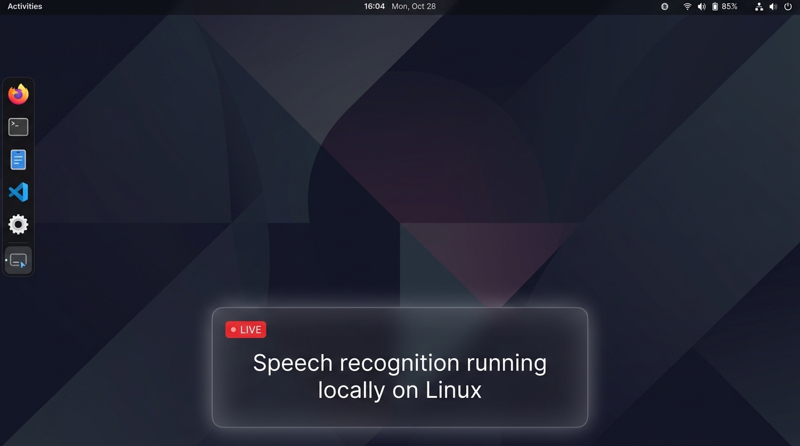

# Auto AI Live Caption

Real-time, offline-first speech-to-text live captioning desktop overlay for Linux. Optimized for KDE Plasma Wayland and GNOME with PipeWire audio architecture.



[](https://github.com/fadhilrobbani/auto-ai-live-caption/actions/workflows/ci.yml)
[](LICENSE)
[](https://python.org)
[](https://pypi.org/project/PySide6/)
[](https://github.com/SYSTRAN/faster-whisper)

---

## Features

- **System Audio and Microphone Capture**: Captures desktop audio streams directly from PipeWire / PulseAudio loopback monitors (`@DEFAULT_MONITOR@`) or hardware microphones (`@DEFAULT_SOURCE@`). Automatically detects when output devices switch (e.g. plugging in Bluetooth TWS earbuds or a USB DAC).
- **Offline Speech Recognition**: Runs pre-quantized INT8 Faster-Whisper models locally on CPU without sending audio data over the internet.
- **Pluggable Cloud Engine Fallbacks**: Switch dynamically between offline local models, ultra-fast cloud LPUs via Groq Whisper (`whisper-large-v3-turbo`, <200ms latency), or OpenAI Whisper API.
- **Real-Time Word Streaming**: Emits in-flight tentative words in real-time (~300ms latency) while speaking, then commits full sentences at natural speech pauses with duplicate filtering.
- **Voice Activity Detection**: Uses Silero VAD combined with RMS energy gating to eliminate silence, filter background noise, and prevent Whisper hallucinations.
- **Translucent Floating Overlay**:
  - Frameless glass card floating above all workspace windows (`Always on Top`).
  - Adjustable opacity from 0% (fully transparent cinema subtitles with black outline shadows) to 100% solid dark glass.
  - Native compositor window dragging on Wayland (`startSystemMove`) and X11.
  - Clean focus mode with zero layout shift: controls collapse into a discrete corner indicator that hides completely when the cursor leaves the window.
  - Dynamic vertical text centering: single and double-line captions stay balanced in the center of the card without empty whitespace.
- **Multilingual Support**: Supports auto-detection and 90+ Whisper languages including English (`en`), Indonesian (`id`), Japanese (`ja`), Spanish (`es`), and German (`de`).

---

## Quick Start

### 1. Prerequisites
- Python 3.10 or newer.
- System audio utilities: `pipewire-pulse` or `pulseaudio-utils` (`parec`, `pactl`).
- Virtual environment or system Python with dependencies from `requirements.txt`.

### 2. Installation & Run
```bash
# Clone the repository
git clone https://github.com/fadhilrobbani/auto-ai-live-caption.git
cd auto-ai-live-caption

# Install Python dependencies
pip install -r requirements.txt

# Run application
python main.py
```

### 3. Command-Line Options
```bash
# Capture from microphone in Indonesian:
python main.py --source mic --language id

# Capture desktop audio with custom font size and opacity:
python main.py --source desktop --font-size 22 --opacity 0.25

# Specify custom model path:
python main.py --model-path /path/to/faster-whisper-model
```

### 4. Desktop Menu Integration
```bash
cp auto-ai-live-caption.desktop ~/.local/share/applications/
update-desktop-database ~/.local/share/applications/
```

---

## Building Packages

Auto AI Live Caption includes a unified build script `packaging/build.sh` supporting AppImage, Debian (`.deb`), Red Hat / Fedora (`.rpm`), and Flatpak.

### Containerized Build (Recommended)
Builds packages inside an isolated Ubuntu 22.04 LTS container. This avoids polluting your host Python environment and ensures the resulting binaries link against GLIBC 2.35 for maximum portability across distributions:

```bash
# Build standalone portable AppImage:
./packaging/build.sh docker appimage
# Output: dist/AutoAILiveCaption-1.0.0-x86_64.AppImage

# Build Debian / Ubuntu package (.deb):
./packaging/build.sh docker deb
# Output: dist/auto-ai-live-caption_1.0.0_amd64.deb

# Build Fedora / RHEL package (.rpm):
./packaging/build.sh docker rpm
# Output: dist/auto-ai-live-caption-1.0.0-1.x86_64.rpm

# Build all portable distributions in one run:
./packaging/build.sh docker all
```

### Direct Host Build
If you prefer building directly on your machine without Docker:

```bash
# AppImage (requires pyinstaller: pip install pyinstaller)
./packaging/build.sh appimage

# Debian / Ubuntu package (.deb)
./packaging/build.sh deb
sudo dpkg -i dist/auto-ai-live-caption_1.0.0_amd64.deb

# Fedora / RHEL package (.rpm)
./packaging/build.sh rpm
sudo dnf install dist/auto-ai-live-caption-1.0.0-1.x86_64.rpm

# Flatpak bundle (requires flatpak-builder and org.kde.Platform//6.8)
./packaging/build.sh flatpak

# Standard Python Wheel
./packaging/build.sh wheel
```

---

## Architecture & How It Works

The application operates as a multi-threaded, zero-IPC audio and inference pipeline:

```
[System Audio / Mic]
        │  (16kHz mono float32 PCM stream via parec)
        ▼
[AudioStreamer] (core/audio/streamer.py)
        │
        ▼
[VADProcessor] (core/vad/processor.py)
        │  - Silero VAD speech detection
        │  - RMS energy noise gate
        │  - Dynamic 1.35s–3.0s segmentation
        ▼
[CaptionWorker QThread] (ui/worker.py)
        │  - In-flight speech preview polling (~300ms)
        ▼
[Pluggable Model Engine] (core/models/)
        ├── FasterWhisperEngine (Local offline INT8 model)
        ├── GroqWhisperEngine  (Cloud LPU <200ms)
        └── OpenAIWhisperEngine (Cloud API)
        │
        ▼
[TextStabilizer] (core/stabilizer/text_stabilizer.py)
        │  - Overlap deduplication across chunk boundaries
        │  - Rolling history aggregation
        ▼
[OverlayWindow] (ui/overlay.py)
        - Translucent floating glass card
        - Dynamic vertical centering
        - Wayland native dragging (startSystemMove)
```

---

## Configuration

Settings are saved in JSON format at `~/.config/auto-ai-live-caption/config.json`:

| Parameter | Type | Default | Description |
| :--- | :--- | :--- | :--- |
| `audio_device_id` | string | `"@DEFAULT_MONITOR@"` | Audio sink/source device identifier |
| `is_monitor` | boolean | `true` | `true` for system audio loopback, `false` for microphone |
| `active_engine_id` | string | `"faster-whisper-..."` | Currently active transcription engine |
| `language` | string | `"auto"` | Target language code (`"en"`, `"id"`, `"auto"`, etc.) |
| `font_size` | integer | `18` | Subtitle font size in pixels |
| `overlay_opacity`| float | `0.25` | Window opacity from `0.0` (fully clear) to `1.0` (solid) |
| `latency_profile`| string | `"fast"` | `"fast"` (live preview), `"balanced"`, or `"accurate"` |
| `hide_controls` | boolean | `false` | Clean text-only focus mode |

---

## Project Structure

```
auto-ai-live-caption/
├── main.py                     # Entry point and Qt application lifecycle manager
├── pyproject.toml              # Build specifications and dependencies
├── requirements.txt            # Python dependencies
├── auto-ai-live-caption.desktop# Desktop menu entry
├── docs/
│   └── screenshot.png          # Application preview screenshot
├── packaging/
│   ├── build.sh                # Unified CLI build orchestrator
│   ├── assets/                 # High-resolution application icons
│   ├── appimage/               # AppRun script and AppImage builder
│   ├── flatpak/                # Flatpak manifest and AppStream metadata
│   ├── nfpm/                   # nFPM configuration for .deb and .rpm
│   ├── docker/                 # Containerized build environment (Ubuntu 22.04)
│   └── pyinstaller/            # PyInstaller spec for standalone directory bundle
├── core/
│   ├── audio/                  # PipeWire/PulseAudio capture and streaming
│   ├── vad/                    # Silero VAD segmenter and noise filter
│   ├── models/                 # Faster-Whisper, Groq, and OpenAI providers
│   ├── stabilizer/             # Subtitle stabilization and duplicate reconciliation
│   └── config/                 # Persistent configuration manager
├── ui/
│   ├── overlay.py              # Floating glassmorphism subtitle window
│   ├── controls.py             # Action toolbar and clean mode toggle
│   ├── settings_dialog.py      # Preferences modal
│   └── worker.py               # Background QThread processing pipeline
└── tests/                      # Automated unit and integration test suite
```

---

## Automated Tests

Run the complete test suite across all modules:
```bash
python -m unittest discover -s tests -p "test_*.py" -v
```

---

## License

This project is licensed under the [MIT License](LICENSE).
